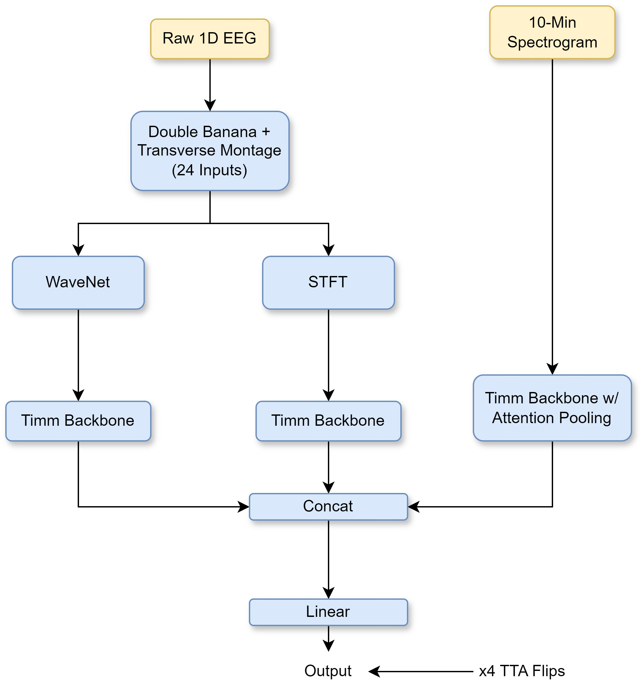
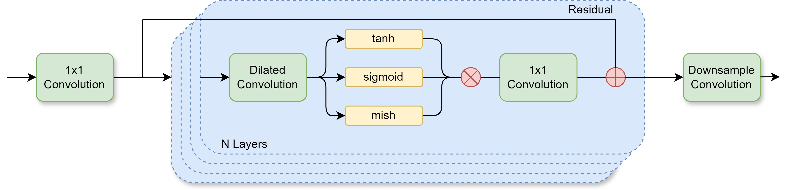
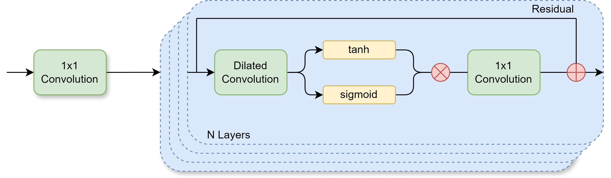
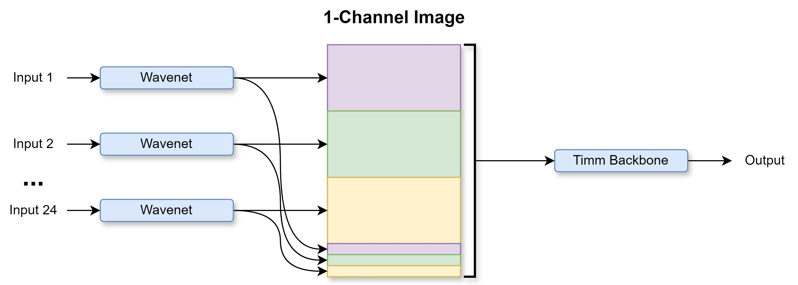
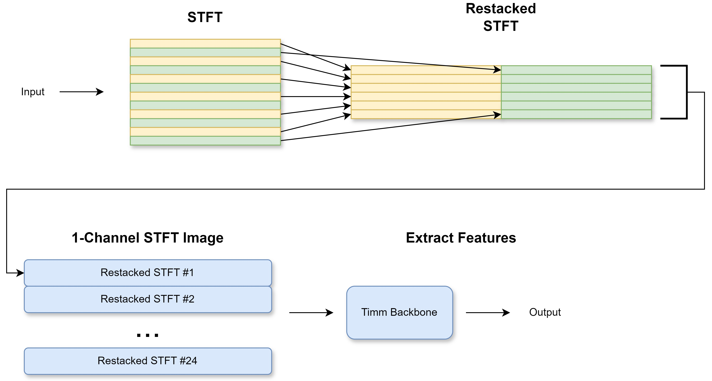
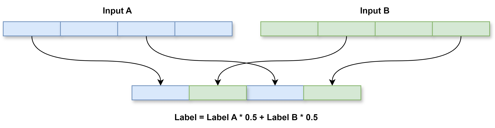

## 15th Place Solution

This repository contains the code for the 15th place solution in the [HMS - Harmful Brain Activity Classification Competition](https://www.kaggle.com/competitions/hms-harmful-brain-activity-classification/overview). The Kaggle write-up can be found [here](https://www.kaggle.com/competitions/hms-harmful-brain-activity-classification/discussion/492193).

TLDR; @ihebch and I built a multimodal model based on three feature extractors. These are an improved 1D-wavenet, a trainable STFT, and an image model with attention pooling for the competition spectrograms. We used `hgnetv2_b4.ssld_stage2_ft_in1k` and `tf_efficientnetv2_s.in21k_ft_in1k` backbones with different architecture configurations to diversify our ensemble. For more details, keep reading!

<h1 align="center">

</h1>

## Fast Experimentation

One of the most important parts of our pipeline was fast experimentation. This allowed us to try creative and crazy ideas quickly. The key points were to use smaller inputs, use smaller backbones, and create spectrograms on GPU using nnAudio. In the last few weeks of the competition, we scaled up from 8x to 24x node differences, increased the size of the model backbones, and concatenated the three feature vectors into one multimodal model.

**Model 1: Improved 1D Wavenet**

Our best single architecture is a wavenet model with some modifications. We add Mish as a third activation function and we use residual connections from the input convolution rather than within each layer. These changes allowed us to use deeper wavenets but we found no significant improvements going beyond 7 blocks. Finally, we added a downsample convolution after the last wave block to significantly reduce vRam usage.

Ours

<h1 align="center">

</h1>

Original

<h1 align="center">

</h1>

Each input sequence is passed through a wavenet with the improved blocks, and the outputs are stacked into a single-channel image. All but two of the output channels are stacked together, with the last two output channels being appended to the end of the image. We did this to create an area where features from all 24 node differences are nearby. The stacked outputs are then passed through a timm backbone to get a feature vector.

<h1 align="center">

</h1>

**Model 2: STFT**

We generated STFTs on GPU using nnAudio. This is very fast, and each training run for this part of the model took 3-10 mins (depending on the STFT parameters). After generating the STFT, we restack the frequency bins into 2 columns. Finally, the STFTs for each input are stacked together and passed through an image model to get a feature vector.

<h1 align="center">

</h1>

We are still unsure why the restacking method worked, but we wanted to share some more thoughts on this. We thought that maybe by reducing the height of the STFT, we were bringing information from different nodes closer together. We tested this by changing the order in which we stacked the STFTs, and saw significant changes to our CV. This indicated to us that the model was learning inter-STFT features and that the order we stacked mattered.

Based on these findings, we believed that we were missing some sort of attention mechanism between inputs. We started experimenting with this during the last few days of the competition but unfortunately ran out of time.

**Model 3: Attention Pooling**

The final feature extractor we used was a timm backbone with attention pooling for the 10-min spectrograms. We found that adding the differences between the spectrograms as new images helped, and applying heavy dropout to the edges of images (0-95%) during training also helped.

## Other Strategies

**Augmentations**

The most important augmentations for us were vertical brain flipping, horizontal brain flipping, and a variant of the CropCat[1] augmentation. Other augmentations we used were brain-size scaling and random noise. We used Brain Flipping during inference as TTA.

CropCat

<h1 align="center">

</h1>

**Training Data**

Like other competitors, we found that training on data with >= 10 votes resulted in better LB scores. We used GKF on this subset to create a correlated CV/LB. To create our training dataset, we grouped by `eeg_id`, selected the rows with the max number of votes, and then removed overlapping segments. We then sampled one data point per eeg_id per epoch. During training, we used weighted kldivergence to emphasize data points with more votes. We also sampled noisy student labels with a probability of 15% to increase model diversity. 

## Final Note

Our solution would not have been possible without the informative notebooks and sharing of [Chris Deotte](https://www.kaggle.com/cdeotte). Also, we mimicked the code structure of [Dieters](https://www.kaggle.com/christofhenkel/) solution from the ASL Fingerspelling Competition [here](https://github.com/ChristofHenkel/kaggle-asl-fingerspelling-1st-place-solution). Thank you both for sharing. 

## Frameworks

- [Pytorch Lightning](https://lightning.ai/docs/pytorch/stable/) (training)
- [Weights + Biases](https://wandb.ai/site) (logging)
- [Timm](https://huggingface.co/timm) (backbones)
- [nnAudio](https://github.com/KinWaiCheuk/nnAudio) (STFTs)

# Sources

[1] CropCat: Data Augmentation for Smoothing the Feature Distribution of EEG Signals. https://arxiv.org/abs/2212.06413
